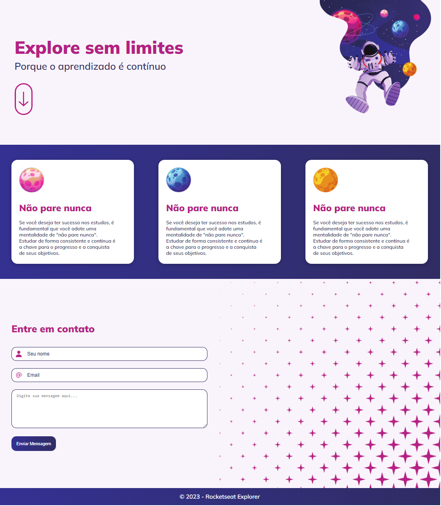

<h1> Explorer sem limites </h1>

 

<h2> O Projeto </h2>

O projeto foi desenvolvido como desafio do curso Explorer da Rocketseat.

O desafio desse projeto consiste na criação de uma landing page que simula uma página simples, onde foi inserido algumas animações, formulário e o conceito de mobile first para se adaptar de acordo com as características do dispositivo em que está sendo visualizado a página.  

  

 

[Visite o projeto online]()

<h2> Tecnologias </h2>

Foi utilizado as seguintes tecnologias para desenvolver esse projeto:

- HTML
- CSS
- figma
- GitHub
